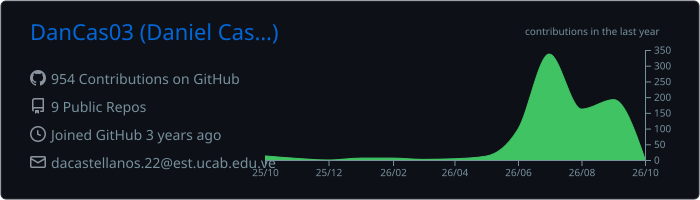
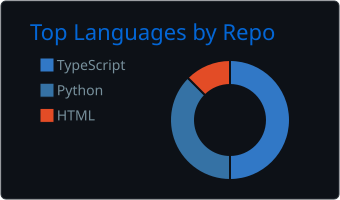
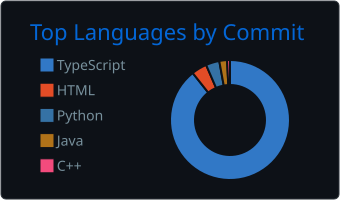
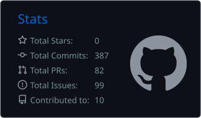
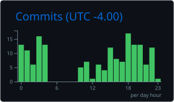

# Daniel Castellanos

**Full-Stack Developer · AI-Assisted Engineering · Informatics Engineering student**

I build full-stack web and mobile applications with TypeScript and Python, and I like bringing AI into the product, from trained models to agentic development workflows.

- 🏗️ Interested in **Clean Architecture**, **Domain-Driven Design** and **design patterns** that keep business logic independent of frameworks
- 🤖 Working with **machine learning** (neural networks, NLP with transformers) and **agentic programming** (prompt and agent design and debugging)
- ☁️ Currently learning **cloud computing**
- 🌐 Spanish (native) · English (B2)

## 🔧 Technologies I've worked with

### Programming languages

-  TypeScript,  JavaScript,  Python
-  Java,  C++,  PHP,  Dart

### Frontend Development

-  React,  Next.js,  Angular
-  Tailwind CSS,  shadcn/ui,  HTML5,  CSS3

### Mobile Development

-  Flutter (Riverpod, Hive)

### Backend Development

-  Node.js,  Express,  NestJS
-  Django,  Flask
-  Prisma,  Socket.IO, REST APIs, JWT auth

### Database Management Systems

-  PostgreSQL,  MySQL,  MariaDB
-  MongoDB

### AI & Machine Learning

-  TensorFlow,  Keras,  scikit-learn
-  Hugging Face Transformers,  Streamlit
-  Agentic programming: prompt engineering, building and debugging AI agents

### DevOps & Tools

-  Docker,  GitHub Actions,  Git
-  Vercel,  Bun,  Jest

### Other

-  Arduino (IoT sensors over HTTP),  WordPress plugin development

## 🚀 Featured projects

| Project | What it is | Stack |
|---|---|---|
| [Arrow Maze — API](https://github.com/DanCas03/MazePruebaBack) | REST API for a mobile puzzle game: JWT auth, per-level leaderboards, progress sync. Clean Architecture with a framework-free domain core, GoF patterns, CI with unit + e2e tests | NestJS · TypeScript · Prisma · PostgreSQL · Jest · Docker |
| [Arrow Maze — App](https://github.com/DanCas03/MazePruebaFront) | Flutter client for the same game, with Clean Mobile Architecture, Command-based undo and a procedural level generator | Flutter · Dart · Riverpod · Hive |
| [Horarios](https://github.com/DanCas03/Horarios--) · [live](https://horarios-web-five.vercel.app) | Full-stack scheduling web app (PWA) in a Turborepo monorepo with shared UI and auth packages | Next.js · TypeScript · Prisma · MongoDB · Better-Auth · Tailwind |
| [Liver Cancer Risk Predictor](https://github.com/DanCas03/Web_IA_Predictiva_Cancer) | Web app that predicts cancer risk from 13 clinical features using a neural network served through a REST API | TensorFlow/Keras · Flask · JavaScript |
| [Classical Text Classifier](https://github.com/DanCas03/IA_Proyecto_Final) | NLP system that classifies classical text fragments by theme, with an ETL pipeline and a web UI | Python · BETO (Transformers) · MongoDB · Streamlit |
| [Sirve la Mesa](https://github.com/DanCast03/SirveLaMesa) | Research platform connecting a Godot game to a real-time backend to study food-portioning behavior | Express · Socket.IO · PostgreSQL · Angular |

## 📊 GitHub stats

  

  
  

  
  

## 📫 Contact

